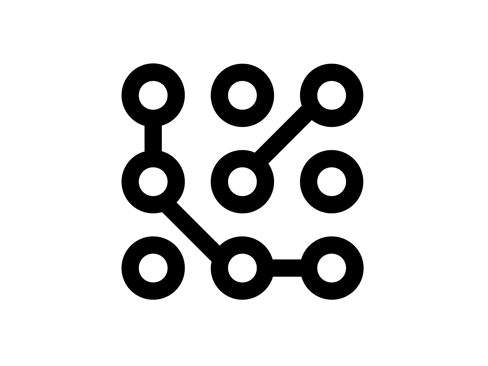

#  EscaGCP

[](https://www.python.org/)
[](https://cloud.google.com/)

**EscaGCP** maps identities, roles, and resources across Google Cloud to uncover attack paths and risky permissions. It collects data (IAM, identities, resources, logs, Cloud Build, GKE, tags), builds a graph, analyzes for privilege escalation and lateral movement, and presents the results in an interactive dashboard or a standalone HTML report.

## ⚠️ Disclaimer

This project is for educational and research purposes and was developed with the help of AI tools. It is not production-ready. Review, test, and harden thoroughly before using it in real environments, and use at your own risk.

## Quick Start

```bash
# Install
pip install -e .

# Run automatic scan (lazy mode)
escagcp run --lazy

# Or run step by step
escagcp collect --projects YOUR_PROJECT_ID
escagcp build-graph --input data/ --output graph/
escagcp analyze --graph graph/escagcp_graph_*.json
escagcp visualize --graph graph/escagcp_graph_*.json
```

By default, `run --lazy` opens the React dashboard. To use the legacy HTML dashboard, add `--use-old-dashboard`. To create a shareable HTML report anytime:

```bash
escagcp export --graph graph/escagcp_graph_*.json --output escagcp_report.html
```

## How it works

1. Collect: callers in `escagcp/collectors/` gather IAM policies, service accounts, projects/folders/orgs, Cloud Build, GKE, tags, and (optionally) audit logs
2. Build: `GraphBuilder` converts the data into a directed graph
3. Analyze: `PathAnalyzer` finds escalation chains, lateral movement, and critical nodes with risk scoring
4. Visualize: view in the React dashboard or export a self‑contained HTML report

## Screenshots

### Security Dashboard (Overview)

*High-level overview with key metrics and quick actions.*

### Graph Visualization

*Interactive visualization of IAM relationships with risk-based coloring.*

### Attack Path Visualization

*Detailed multi-step privilege escalation paths with technique breakdowns and risk scores.*

### Edges Explorer

*Tabular view of relationships grouped by source entity with risk scoring and filtering.*

### Real-time Collection Progress

*Live CLI progress while collecting IAM policies, resources, and audit logs from GCP.*

## Key capabilities

- Comprehensive IAM and identity mapping across org/folder/project scopes
- Attack path discovery (impersonation, key creation, VM/Cloud Run/Functions deploy, Cloud Build, GKE WI, tag-based conditions, and more)
- Risk scoring for nodes and edges; highlights critical nodes, roles, and confirmed activity from audit logs
- Interactive React dashboard (with filters, legend, graph controls) or legacy HTML dashboard
- Shareable, single‑file HTML reports; optional “what‑if” simulations via CLI

## Documentation

- **[Installation Guide](docs/INSTALLATION.md)** - Detailed setup instructions
- **[Getting Started](docs/GETTING_STARTED.md)** - Quick tutorial and basic usage
- **[User Guide](docs/USER_GUIDE.md)** - Complete guide to all features
- **[Attack Techniques](docs/ATTACK_TECHNIQUES.md)** - All detected attack paths explained
- **[Configuration](docs/CONFIGURATION.md)** - Advanced configuration options
- **[API Reference](docs/reference/API.md)** - Python API documentation
- **[CLI Reference](docs/reference/CLI.md)** - Command-line interface reference

## Attack techniques

A concise reference of supported techniques is available in the docs. See [Attack Techniques](docs/ATTACK_TECHNIQUES.md).

## Requirements

- Python 3.8+
- GCP credentials with appropriate permissions
- Required APIs enabled in target projects

[See detailed requirements →](docs/INSTALLATION.md#requirements)

## Contributing

We welcome contributions! Please see [CONTRIBUTING.md](CONTRIBUTING.md) for details.

## Security notice

EscaGCP collects sensitive information about your GCP environment and saves it locally. Review the [Security Checklist](docs/SECURITY_CHECKLIST.md) before sharing any outputs.

## 🙏 Acknowledgments

Inspired by [BloodHound](https://github.com/BloodHoundAD/BloodHound) and built on extensive GCP security research.

---

**Need help?** Check our [FAQ](docs/FAQ.md) or [open an issue](https://github.com/arielkalman/EscaGCP/issues). 
