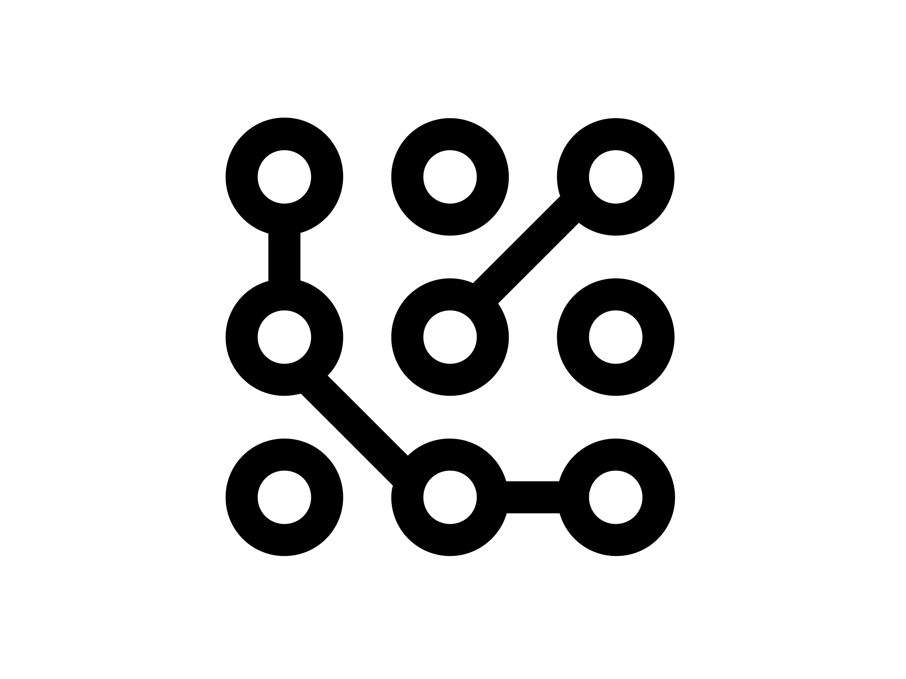

#  EscaGCP

[](https://www.python.org/)
[](https://cloud.google.com/)

**EscaGCP** is a comprehensive graph-based analysis tool for Google Cloud Platform (GCP) that maps IAM relationships and permissions to reveal potential attack paths, similar to BloodHound for Active Directory environments.

## 🚀 Quick Start

```bash
# Install
pip install -e .

# Run automatic scan (lazy mode)
escagcp run --lazy

# Or run step by step
escagcp collect --projects YOUR_PROJECT_ID
escagcp build-graph --input data/ --output graph/
escagcp analyze --graph graph/escagcp_graph_*.json
escagcp visualize --graph graph/escagcp_graph_*.json
```

## 📸 Screenshots

### Interactive Security Dashboard

*The main dashboard showing the interactive graph visualization with 137 nodes and 426 edges. The graph displays IAM relationships between users, service accounts, groups, and resources with risk-based coloring.*

### Attack Path Visualization

*Detailed attack path visualization showing a multi-step privilege escalation chain. The modal displays the attack techniques used, risk scores, and step-by-step exploitation path from a user to a privileged service account.*

### Real-time Collection Progress

*Live progress view during data collection from GCP, showing the tool gathering IAM policies, service accounts, resources, and audit logs across multiple projects.*

## 🎯 Key Features

- **🔍 Comprehensive IAM Analysis**: Maps all IAM relationships across your GCP environment
- **🎯 Attack Path Discovery**: Identifies privilege escalation and lateral movement opportunities
- **📊 Interactive Visualizations**: Beautiful dashboard with graph visualization
- **🚨 Risk Scoring**: Calculates risk scores based on permissions and attack paths
- **🔮 What-If Analysis**: Simulate IAM changes to understand security impact
- **📤 Shareable Reports**: Generate standalone HTML reports

## 📚 Documentation

- **[Installation Guide](docs/INSTALLATION.md)** - Detailed setup instructions
- **[Getting Started](docs/GETTING_STARTED.md)** - Quick tutorial and basic usage
- **[User Guide](docs/USER_GUIDE.md)** - Complete guide to all features
- **[Attack Techniques](docs/ATTACK_TECHNIQUES.md)** - All detected attack paths explained
- **[Configuration](docs/CONFIGURATION.md)** - Advanced configuration options
- **[API Reference](docs/reference/API.md)** - Python API documentation
- **[CLI Reference](docs/reference/CLI.md)** - Command-line interface reference

## 🛡️ Detected Attack Techniques

EscaGCP detects all known GCP privilege escalation techniques:

- **Service Account Impersonation** - Token generation abuse
- **Service Account Key Creation** - Long-lived credential theft
- **ActAs Privilege Escalation** - VM/Function/Cloud Run deployment
- **Cloud Build Exploitation** - CI/CD pipeline abuse
- **Workload Identity Federation** - External identity mapping
- **Tag-Based Escalation** - IAM condition bypass
- **And many more...**

[See full list →](docs/ATTACK_TECHNIQUES.md)

## 📋 Requirements

- Python 3.8+
- GCP credentials with appropriate permissions
- Required APIs enabled in target projects

[See detailed requirements →](docs/INSTALLATION.md#requirements)

## 🤝 Contributing

We welcome contributions! Please see [CONTRIBUTING.md](CONTRIBUTING.md) for details.

## ⚠️ Security Notice

EscaGCP collects sensitive information about your GCP environment and save it locally. Before sharing outputs, review the [Security Checklist](docs/SECURITY_CHECKLIST.md).

## 🙏 Acknowledgments

Inspired by [BloodHound](https://github.com/BloodHoundAD/BloodHound) and built on extensive GCP security research.

---

**Need help?** Check our [FAQ](docs/FAQ.md) or [open an issue](https://github.com/arielkalman/EscaGCP/issues). 
